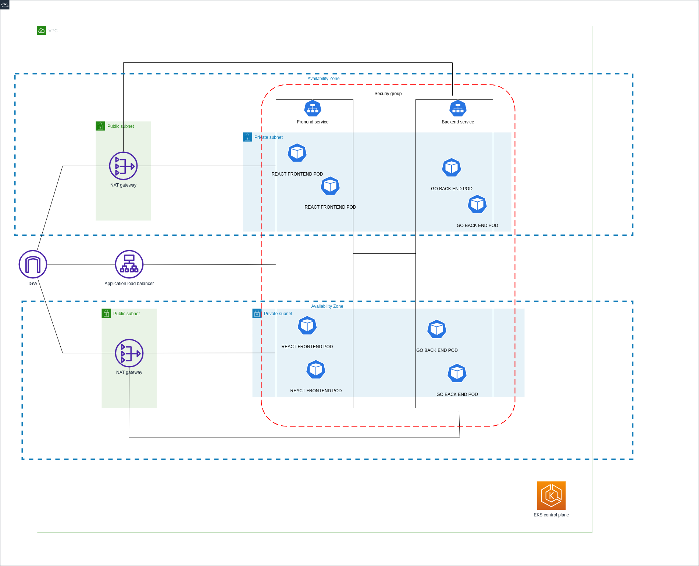

# TransportOptimizer: Efficient Trip Planning Application

## Description

TransportOptimizer assists users in efficiently planning their travel route by sequencing their desired destinations. Leveraging the modified Traveling Salesman Problem (TSP) algorithm, it lets users apply optional constraints, such as mandating the sequence of specific locations. We harness the power of the Google Maps API to determine the shortest paths between destinations.

## Tech stack
- React/TypeScript
- C#/.NET 8
- Docker
- Kubernetes/EKS
- Terraform
- Github Actions

## Architecture



## Variables

### Frontend Build Environment Variables

| Variable Name                     | Description                                                                                                                                                          |
|-----------------------------------|----------------------------------------------------------------------------------------------------------------------------------------------------------------------|
| `REACT_APP_GOOGLE_MAPS_API_KEY`   | Google Maps API key for the interactive map. The API key is included in the build. Please restrict the API key for its specific use cases, with additional restrictions such as IPs, and rate limits. |
| `REACT_APP_API_URL`               | URL of the backend API.                                                                                                                                              |
| `REACT_APP_GOOGLE_MAPS_DISPLAY_URL` | URL used for displaying Google Maps.                                                                                                                                |

### Backend Runtime Environment Variables

| Variable Name                    | Description                                                                          |
|----------------------------------|--------------------------------------------------------------------------------------|
| `CorsSettings:AllowedOrigins`    | Origins for CORS settings in the backend. No cors needed for the deployment.         |
| `GoogleMaps:ApiKey`              | Google Maps API key used by the backend.                                             |
| `GoogleMaps:ApiUrl`              | API URL for Google Maps, used by the backend.                                        |


## Running the application
### With locally .NET and Node.js (TBD)

### Deploy locally with Docker compose
Add the backend variables in the .env.local.docker-compose-backend. Start the local cluster
```bash
docker compose up -d
```
The application started at port 8001.
To shutdown 
```bash
docker compose down
```


### Deploy to K8s cluster

You first need to connect to the K8s cluster, e.g.:

```bash
aws eks update-kubeconfig --name _your_eks_cluster_name
```
or create your own local cluster, e.g.

```
k3d create cluster _your_cluster_name
```

The k8s cluster will pull the images from DockerHub. After that, apply the k8s files with the environment variables using
```
helm upgrade --install transport-optimizer ./app-chart
```
````


