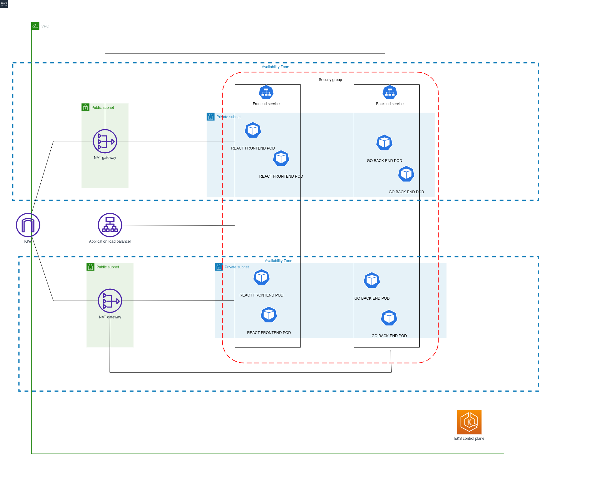

# TransportOptimizer: Efficient Trip Planning Application

## Description

TransportOptimizer assists users in efficiently planning their travel route by sequencing their desired destinations. Leveraging the modified Traveling Salesman Problem (TSP) algorithm, it lets users apply optional constraints, such as mandating the sequence of specific locations. We harness the power of the Mapbox APIs (via a backend proxy) to determine travel times and map visuals.

## Tech stack

- React/TypeScript
- C#/.NET 8
- Docker
- Kubernetes/EKS
- Terraform
- Github Actions

## Architecture



## Variables

### Frontend Build Environment Variables

| Variable Name                       | Description                                                                                                                                                                                           |
| ----------------------------------- | ----------------------------------------------------------------------------------------------------------------------------------------------------------------------------------------------------- |
| `VITE_API_URL`                      | URL of the backend API (default: `/api`).                                                                                                                                                             |
| `VITE_TILE_URL`                     | Optional override for the backend tile proxy endpoint (default: `${VITE_API_URL}/tiles/{z}/{x}/{y}.png`).                                                                                           |

### Backend Runtime Environment Variables

| Variable Name                 | Description                                                                  |
| ----------------------------- | ---------------------------------------------------------------------------- |
| `CorsSettings:AllowedOrigins` | Origins for CORS settings in the backend. No cors needed for the deployment. |
| `Mapbox:AccessToken`          | Mapbox access token used by the backend.                                     |
| `Mapbox:ApiUrl`               | API URL for Mapbox, used by the backend (e.g. `https://api.mapbox.com`).      |
| `Mapbox:TileStyleId`          | Style identifier for tiles (e.g. `mapbox/streets-v12`).                       |
| `Mapbox:TileResolution`       | Tile resolution (`low` = 256px, `high` = 512px).                               |
| `Mapbox:TileSize`             | Tile size in pixels (256 or 512).                                            |
| `Mapbox:GeocodeCacheMinutes`  | Cache duration for successful geocodes (minutes).                            |
| `Mapbox:GeocodeFailureCacheMinutes` | Cache duration for failed geocodes (minutes).                           |
| `Mapbox:DirectionsProfile`    | Profile for directions requests (e.g. `driving`).                             |
| `Mapbox:MatrixProfile`        | Profile for matrix requests (e.g. `driving`).                                 |

## Running the application

### With locally .NET and Node.js (TBD)

### Deploy locally with Docker compose

Add the backend variables in the .env.local.docker-compose-backend. Start the local cluster

```bash
docker compose up -d
```

The application started at port 8001.
To shutdown

```bash
docker compose down
```

### Deploy to K8s cluster

You first need to connect to the K8s cluster, e.g.:

```bash
aws eks update-kubeconfig --name _your_eks_cluster_name
```

or create your own local cluster, e.g.

```
k3d create cluster _your_cluster_name
```

The k8s cluster will pull the images from DockerHub. After that, apply the k8s files with the environment variables using

```
kubectl apply -f infra/k8s/namespaces.yaml
helm upgrade --install transport-optimizer infra/app-chart --namespace transport-stage
# or use --namespace transport-prod
```
