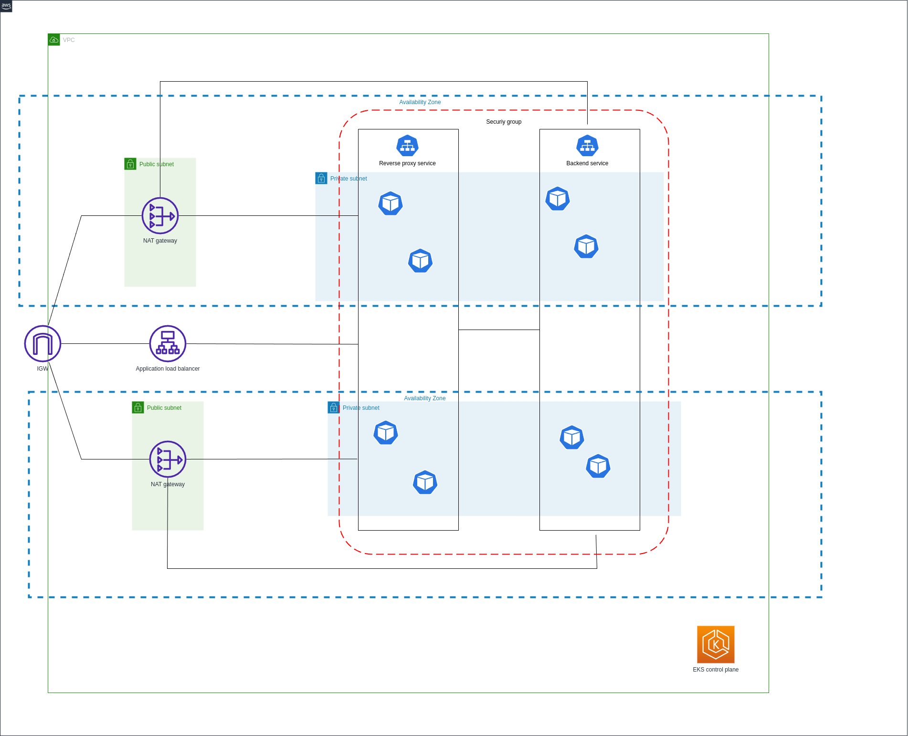

# TransportOptimizer: Efficient Trip Planning Application
## Description

TransportOptimizer assists users in efficiently planning their travel route by sequencing their desired destinations. Leveraging the modified Traveling Salesman Problem (TSP) algorithm, it lets users apply optional constraints, such as mandating the sequence of specific locations. We harness the power of the Google Maps API to determine the shortest paths between destinations.

## Tech stack
- Go
- Docker
- K8s/EKS
- ReactJS
- Terraform

## Architecture

Frontend: Built with ReactJS.

Backend: Developed in Go to compute TSP algorithm.

Our system architecture follows a microservices pattern, hosted on Amazon Elastic Kubernetes Service (EKS), a managed Kubernetes service. We've ensured scalability by automating the scaling of the Kubernetes control plane with EKS.

Furthermore, we've adopted a principled approach to infrastructure management using Infrastructure as Code (IaC) with Terraform.





## Run locally with Docker
You need to first the following environment variables

| Variable Name           | Description                                                                                                 |
|-------------------------|-------------------------------------------------------------------------------------------------------------|
| REACT_APP_GOOGLE_MAPS_API_KEY            | Google Maps API |

Run in development mode 
```
docker compose up
```

Run in production mode
```
docker compose up -f docker-compose.prod.yml
```

### Deploy to K8s cluster
You first need to connect your to the K8s cluster, e.g.

```
aws eks update-kubeconfig --name _your_eks_cluster_name
```

Then set the following environment variables 


| Variable Name           |Value                                                                                                 | 
|-------------------------|-------------------------------------------------------------------------------------------------------------|
| BACKEND_IMAGE            | longhuynh5713/transportback:lastest|
| FRONTEND_IMAGE            |  longhuynh5713/transportfront:lastest|


The k8s will pull the images from docker hub. After that, apply the k8s files with the environment variables using

```
    find k8s -name "*.yml" | while read file; do
        envsubst < "$file" | kubectl apply -f -
    done
```

